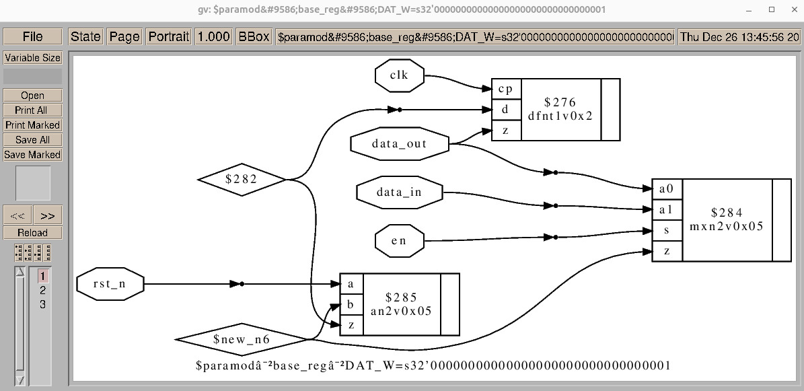

# About veri_env

This is a personal project designed to provide a CAD suite for RTL development.
The project utilizes free software and open-source projects like IcarusVerilog, GTKWave, yosys and more to provide the user with tools to:
1. Control and describe elaborate designs - using a basic and easy-going config language to describe, create and release blocks.
2. Design - describe registers using an in-house register-description-language that is python based and integrates with this environment
3. Compile - using wrappers around IcarusVerilog to seamlessly compile designs
4. Simulation - utilizing cocotb infrastructure to provide the user with an easy way to create testbenches as well as generating automatic ones
5. Synthesis - a flow based on the open-source yosys framework

This work is a result of my personal desire to comfortably develop my designs without relying on licenses and with easy and robust flows.
Developing this environment I drew alot of ideas and inspiration regarding what should be considered as good, comfortable flows from several engineers I got the pleasure of working with through the years. I owe these individuals a great deal of gratitude.

## Setup - first use only

1. Create a directory for the tools with your version of my_defs.sh (see my_defs_template.sh)

```bash
    mkdir tools
    cd tools
    git clone git@github.com:dodlido/veri_env.git 
    cp veri_env/my_defs_template.sh tools/my_defs.sh
```

   * Fill the my_defs.sh file with your personal prefrences and variables
   * Note that you will need to [provide a github api key](https://docs.github.com/en/authentication/keeping-your-account-and-data-secure/managing-your-personal-access-tokens)

2. Download python's virtualenv library:

```bash
    pip3 install virtualenv
```
 
3. Under the tools directory, create a virtual env:

```bash
    python3 -m venv py_venv
```

4. Add to the activate script in py_venv/bin/activate with the following line:
   * source ${0%/*}/../../my_defs.sh 

5. Source the setup script:

```bash
    source tools/veri_env/setup.sh w setup
    cd -
```

6. Python's virtual environment should be set-up by now, you can verify this by:

```bash
    which python3
    >> tools/py_venv/bin/python3
```

7. Install python packages:

```bash
    pip3 install gitpython
    pip3 install requests
    pip3 install cocotb
```

8. Install make:

```bash
    sudo apt-get install build-essential
```

9. [Install](https://steveicarus.github.io/iverilog/usage/installation.html#) IcarusVerilog for verilog compilation

10. [Install](https://flathub.org/apps/io.github.gtkwave.GTKWave) GTKWave for waveform viewing

11. [Install](https://github.com/YosysHQ/yosys) yosys for synthesis

12. [Install](https://ftp.gnu.org/gnu/gv/) gv for viewing a graphic representation of synthesis results

## Setup Script

1. When opening a new terminal, use setup to:
   * Familiarize the terminal with the 'veri_env' tools
   * Create a new workspace named 'my_workspace' and cd to $home_dir/my_workspace
   * Activate the python virtual environment
   * Create the sim, add, get aliases to the 'veri_env' tools

```bash
    source tools/veri_env/setup.sh w my_workspace
```

## File-System 

1. Under a given *workspace*, there could be any number of *project*s
2. *project*s are repositories
3. Under each *project* there could be up to 2 folders:
   - *design* - contains all design blocks under this project
   - *verification* - contains all verification blocks under this project
4. Under *design* there could be any number of *block*s, each in its own subfolder named "block_name"
5. Under each *design block* there could be up to 2 folders:
   - *rtl* - contains all the RTL of the *design block*
      - Under the *rtl* folder there could be any number of verilog source files
   - *misc* - contains the *design block* configuration file
      - The configuration file must be of the format "block_name.cfg"
      - The configuration file syntax is explained below
      - For each *design block* there could be a folder under the *verification* tree which contains:
         - a folder named *tests* which contains a cocotb testbench named "block_name_tb.py"
         - any number of folders and scripts that "block_name_tb.py" needs to function
6. You can always create a block skeleton at your own workspace:
```bash
╰─ blk -b blk
╰─ tree -a
.
├── design
│   └── blk
│       ├── .env
│       ├── misc
│       │   └── blk.cfg
│       ├── regs
│       │   └── blk_rgf.py
│       ├── rtl
│       │   └── blk_top.v
│       └── .vscode
│           └── settings.json
└── verification
    └── blk
        ├── .env
        ├── tests
        └── .vscode
            └── settings.json
```
   * The hidden files are placed there intentionally in order to allow for syntax highlighting and autocompletion using vscode and coding with the veri-env classes and functions

## Configuration syntax

1. The configuration file utilizes 2 fundamental concepts:
   * *section*:  
      * *section* begins with "[section_name]"
      * *section* ends with ";"
      * There are a few reserved *section*s like [genral], [path]
      * Other *section*s can be of **view** names, for example [rtl]. 
         * **view** is "a way of looking at a project" 
         * Each **view** can define for example its own filelist
         * **view**s can be simulated separately
   * *key*: 
      * *key*s can be found under *section*s
      * Some *key*s have a **value** (or multiple **value**s) attached to them
      * single **value** *key* syntax:
         ```cfg
            key=value
         ```
      * multiple **value**s *key* syntax:
         ```cfg
            key:
               value1
               value2
               ...
         ```

2. [general] *section*:
   * This section is mandatory and specifies the *block* name and *project*:

   ```cfg
      [general]
         block=<project_name>/design/<block_name>
      ;
   ```

3. [path] *section*:
   * This section can be used to to specify where to find other *design block*s this *design block* utilizes as **children**.
   * Accepted *key*s are other *design blocks* specified in <project_name>/design/<block_name> format like in the [general] *section*
   * Accepted **value**s are:
      * "local" which means that the *design block* is somewhere within the workspace
      * "release, X.Y.Z" which means that the *design block* is in your release storage (location defined in my_defs.sh)

   ```cfg
      [path]
         <project1_name>/design/<block1_name>=local
         <project2_name>/design/<block2_name>=release, X.Y.Z
      ;
   ```

4. [view] *section*s:
   * *section*s that are not [general] or [path] are referred to as **view**s
   * Each **view** can contain up to 3 reserved *key*s:
      * **design** defines the top module of the view:
      * **define** adds defines (macro directives `define) of all provided keys to the compilation tree
      * **child** defines the **children** **view**s used in this **view**
      * **regs** Regen defined registers file, see explanation below
      * **file** defines the filelist the **view** utilizes (from this *design block* only, without referring to **children**) 
   
   ```cfg
      [rtl]
         design:
            top=<top_level_module_name>
         child:
            <project1_name>/design/<block1_name>=<view1_name>
            <project2_name>/design/<block2_name>=<view2_name>
         regs:
            regs/<block_name>_rgf.py
         file:
            <rtl/file1.v>
            <rtl/file2.v>
            ...
      ;
   ```

## Regen - Register Description Language
This environment offers a register description language for the user.
With the regen language, come multiple features:
1. Register files are described in a python code.
2. verilog, html, json files are all generated automatically from the python code. Use the ['reg' script](./regen.py) to get any of the described outputs.
3. The verilog file is not needed for simulation, the translation process happens on the fly and appended to your filelist during the compilation process.
4. The verilog file contains:
   1. A register file, with all the described registers
   2. An APB slave
   3. An APB IF for the SW to write register values to
   4. HW IF containg all the relevant ports for the HW to interact with
5. Integrating an instance of the register file to the design is automatic.
6. Infrastructure to write and read registers over APB, refering to different fields by name without having to handle addresses and strobes:
   1. APB Transaction - base transaction class that translates a field name to an APB transaction in terms of addres and strobe.
   2. APB Driver - drives different transactions
   3. APB Monitor - monitors an APB bus for valid transactions
7. Different type of attributes are built-in with endless other possibilities:
   1. Configuration fields - SW write and read, HW read only
   2. Status fields - HW write SW read
   3. Interrupts - sticky bits with interrupt aggregation 
   4. SW write and SW read pulses - to notify the HW of changes in desired fields
For an elaboration, see the [README file](./regen/README.md)

## Simulation
1. Use sim.py for all you simulation needs
2. Flags: 
   * -w WORKSPACE :  workspace name, optional, if cwd is within some workspace this is not necessary
```bash
sim -w show
> VERI-ENV NOTE: available workspaces
  <workspace1>
  <workspace2>
  ...
```
   * -c PATH      :  path to a configuration file, optional, if cwd is within *design block* this is not necessary
   * -v VIEW      :  view name, required, "show" keyword will list all available views:
```bash
sim -v show
> VERI-ENV NOTE: available views
  <view1>
  <view2>
  ...
```
   * --waves      :  Open gtkwave, optional trigger 
   * --no-coco    :  Run IcarusVerilog compilation only, without simultation
   * --sim-time   :  Set simulation time for automatic testbench, specified in [cycles]
3. The target directory of the simulation results is $work_dir/ws_name/block_name where $work_dir was defined in your my_defs.sh
4. Which test will run? 
   * If sim.py found an existing testbench in the reserved path as explained in the file system section, it will use it for simulation
   * Otherwise, an automatic testbench will be generated. See next section for an explanation on the automatic test capabilities
5. sim.py will print a log that summarizes all the generated results at the end of each run

## Automatic Test Capabilities
1. Parses the top-level ports according to the following types:
   * **clock** - any input port that contains the substring *clk*
   * **reset** - any input port that contains the substring *rst* or *reset*
   * **input** - any input port that does not fit either **clocks** or **resets**
   * **panic** - any output port that contains the substring *panic*
   * **output** - any output port that is not a **panic**
2. **clock**s are all generated with the same 1ns cycle at the beginning of the test 
3. **reset**s are assumed to be active low. asserted low for 10 clock cycles at the beginning of the test and then deactivated
4. **input**s are:
   * Initialized with 0 while reset coroutine is active
   * Assigned a different random value (with regard to the port width) every cycle after reset
5. **panic**s are used as cocotb assertions that are asserted if the panic signal is high. This signals should be driven by the design to indicate error cases.
6. **output**s are not handled in any way buy the tests at this moment

## Synthesis
1. Synthesis is based on the [yosys framework](https://github.com/YosysHQ/yosys)
2. You can choose any cells library you would like:
   * point to it in your own my_defs.sh file
   * I am currently using [this one](http://www.vlsitechnology.org/synopsys/vsclib013.lib), which sadly does not support async reset ffs
3. The syn.py script will run synthesis based on the [template script](./resources/synth_template.txt) adapted to your use case
```bash
    syn -v <view_name>
```
   * same -v and -w rules apply here regarding the optionallity of the flags and the "show" keyword
4. Use the --show flag to open gv for a graphic representation of the synthesis results
   * Here is a representation of a 1b FF with an enable bit to select whether to sample the data or not and a sync reset:

5. syn.py will print a log that summarizes all the generated results at the end of each run

## Managing blocks
1. Users can use the 'add' alias to add a new git repository to their on github account
2. Users can use the 'get' alias to get to their current workspace a clone of any remote repository from their github account
3. Users can use the 'rls' alias to create a release of any repository. This will:
   * sign all verilog source files with the date, version and author's name
   * Create a remote tag
   * Create a local copy of the repo at the location provided in my_defs.sh
4. Users can use the block.py script (aliased as 'blk') to create a template of a new block with a given name

## TODO:
* add --pretty flag to syn
